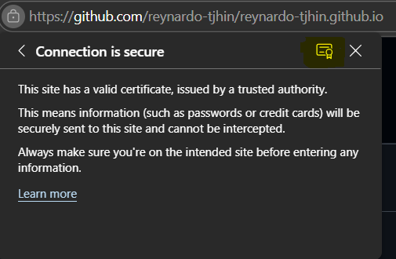
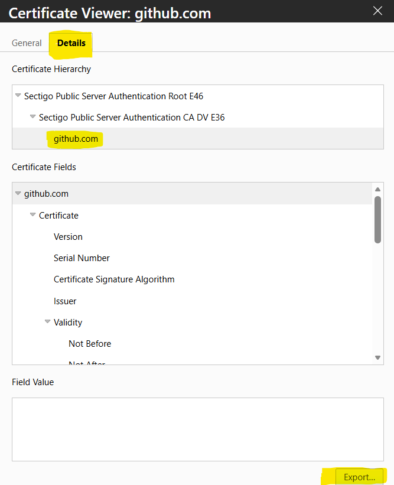

# Basic Git Problems and Solutions

I'm writing the Git problems that I faced here in this blog post. I delve deeper into what the issue is about and how the issue happens. I also present the solutions to the issue, mainly from online.

<!-- more -->

## Issue: SSL certificate problem: unable to get local issuer certificate.

This issue usually happens when I'm trying to clone a repository via HTTPS from my work laptop. The error occurs because Git cannot verify the certificate chain due to missing certificates or misconfiguration.

### The Issue

Two problems can cause this:

**Problem 1: Git's CA bundle path is broken**

- Git cannot find its default certificate bundle
- Check with: `git config --get http.sslCAInfo` (if it returns empty, this is the problem)

**Problem 2: Corporate proxy interference**

- Company proxy intercepts the connection
- May strip intermediate CA certificates from the chain
- Or performs SSL inspection, replacing GitHub's cert with company-signed cert

```txt
my Git client
> sends 'hello' message

company proxy
> directs the 'hello' message from Git client to GitHub server

the GitHub server
> receives 'hello' message from company proxy
> sends 'hello' message to company proxy
> (containing the github.com cert + intermediate CA cert)

company proxy
> receives the 'hello' message from the server
> strips/blocks the intermediate CA cert
> redirects the 'hello' message from GitHub server to Git client
> intermediate CA lost

my Git client
> receives the 'hello' message
> gets the SSL certificate from the 'hello' message
> verify the SSL certificate with the Certificate Authority (CA)
> unable to verify because missing intermediate CA (incomplete chain)
> presents the error: "unable to get local issuer certificate"
```

Note: Some corporate proxies also perform SSL inspection, replacing GitHub's certificate entirely with one signed by the company CA. In that case, you'd need to install the company's root CA certificate instead.

### The Solution

Read some of the solutions here: [Stack Overflow](https://stackoverflow.com/questions/37551178/error-message-unable-to-get-local-issuer-certificate-when-cloning-a-project-fr)

**Option 1: Fix Git's CA bundle path (recommended)**

```bash
# use OpenSSL as the SSL Backend
git config --global http.sslBackend "openssl"

# point Git to its bundled certificates
git config --global http.sslCAInfo "C:\Program Files\Git\mingw64\etc\ssl\certs\ca-bundle.crt"
```

**Option 2: Export and use GitHub's certificate**

If option 1 does not work due to the `ca-bundle.crt` file not present or the ca-bundle certificate is incomplete, try the second option.

1. Go to the browser and visit the github repository
2. Click on the lock icon
    

3. Get the certificate details (usually there's a certificate icon like the following image)
    

4. Export the certificate (or generally export the Root )
    

5. Save the exported certificate (file extension can be .cer or .crt - doesn't matter)

6. Configure Git:

    ```bash
    # Check current setting (if empty, Git can't find CA bundle)
    git config --get http.sslCAInfo

    # Set to your exported certificate
    git config --global http.sslCAInfo "C:\Users\Public\Downloads\github.com.cer"
    ```

7. Retry cloning the repository

<!-- ## Task:  -->