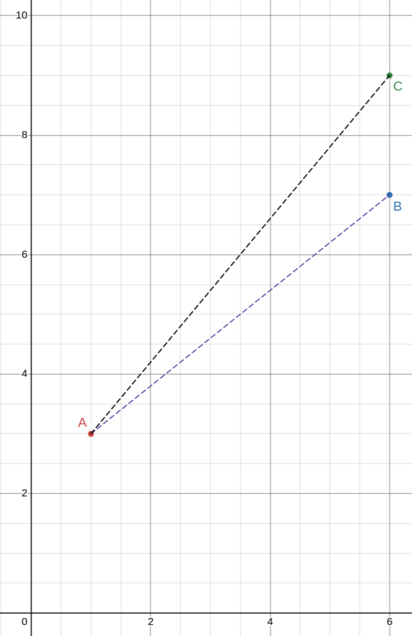

# Template Matching Part I

[GitHub Repository](https://github.com/reynardo-tjhin/template-matching/)

Template matching is a digital image processing technique used to find the coordinates/location of a small template image in a given input image. It uses a technique called sliding window technique.

## Similarity

### Distance Between 2 Pixels

Firstly, we need to understand how to calculate the similarity between two images of the same size. The similarity can be measured by distance. Given that we can describe images in pixels, we can calculate the distance between the two images to understand how similar both images are to each other.

Assuming we have a target image with only a single pixel on a 2-dimensional plane. We also have two different images, also with a single pixel each, to compare how similar these images are to the target image.

- Let's name the target image A which has a coordinate of $(1, 3)$.
- And, we also name the other images: 
    - B with a coordinate of $(6, 7)$, and
    - C with a coordinate of $(6, 9)$.



The smaller the distance between the pixels, the more similar the images are. With the distance being 0, both images are exactly the same because they lie on the same coordinate. To calculate distance, we can use the Pythagoras' theorem: $a^2 = b^2 + c^2$ where $a$ is the distance.

For example:

- the height between coordinate $A$ and $B$ = $y_{B} - y_{A}$
- the width between coordinate $A$ and $B$ = $x_{B} - x_{A}$
- therefore, the distance can be calculated by = $\sqrt{(y_{B} - y_{A})^2 + (x_{B} - x_{A})^2}$

Since we are comparing the similarities (or the distances) and not actually calculating the distance, we can just ignore the square root. 

- the "distance" between A and B is $(7 - 3)^2 + (6 - 1)^2 = 41$
- the "distance" between A and C is $(9 - 3)^2 + (6 - 1)^2 = 61$

Hence, the image B is more "similar" to the image A than the image C.

### Sum of Squared Distance (SSD)

But now, instead of an image with 2-dimensional pixel, we have an image with 1-dimensional pixel. Therefore, we can simplify the distance to $(y_{image} - y_{target})^2$.

The image that we just used in the above example only has a single pixel. But images normally have more than a single pixel. To calculate the similarity between the images, we can just add all the distances between each pixel of the target and the image. This is called the sum of squared distance (SSD).

Formally, SSD can be calculated using the following formula:

$$
SSD_{M} = \sum_{(x,y) \in P_{M}}{(T(x, y) - P_{M}(x,y))^{2}}
$$

Let's assume we have a target image (2x2 pixels) and two other images (2x2 pixels).

```txt
target:    image A:    image B:
1 1        1 1         1 0
0 1        1 1         1 0
```

From a glance, we can tell that image A is more similar to the target because only the 2nd row 2nd column pixel is different while image B has 3 pixels that are different to the target.

**Note**: I start $x$ and $y$ from $1$ to indicate the row and column numbers.

To calculate the SSD between A and the target

$$
distance = (T(1,1) - P(1,1))^2 + (T(1,2) - P(1,2))^2 + 
$$

$$
(T(2,1) - P(2,1))^2 + (T(2,2) - P(2,2))^2
$$

$$
distance = (1 - 1)^2 + (1 - 1)^2 + (0 - 1)^2 + (1 - 1)^2 = 1
$$

The same goes for SSD between B and the target

$$
distance = (1 - 1)^2 + (1 - 0)^2 + (0 - 1)^2 + (1 - 0)^2 = 3
$$

The distance between A and the target is smaller. Hence, image A is more similar to the target image.

_There are also other ways to calculate distance such as Absolute Distance._


## Sliding Window Technique

Now that we know how to get the similarity between images of the same size, we need to find a way to find the location/coordinates in an input image that matches the template image. We use a technique called sliding window technique. We create a window of the same size as the template image. And then we slide this window from left to right, top to bottom, and compare each window to the template image.

Consider we have an input image of size 6x10 pixels (6 rows and 10 columns of pixels) and we have a template image of 2x2 pixels (2 rows and 2 columns of pixels). Each number represents a single pixel.

```txt
input_image:    template:

0000000000      11
0110000000      11
0110100110
0001001110
0010010000
0000000000
```

The window size matches the template's size. We slide the window from left to right, top to bottom, like below:

```txt
1st window      2nd window     3rd window   ... 9th window
+--+             +--+            +--+                   +--+
|00|00000000    0|00|0000000   00|00|000000     00000000|00|
|01|10000000    0|11|0000000   01|10|000000     01100000|00|
+--+             +--+            +--+                   +--+
 01 10100110    0 11 0100110   01 10 000110     01101001 10
 00 01001110    0 00 1001110   00 01 001110     00010011 10
 00 10010000    0 01 0010000   00 10 010000     00100100 00
 00 00000000    0 00 0000000   00 00 000000     00000000 00


10th window     11th window    12th window  ... 18th window
 00 00000000    0 00 0000000   00 00 000000     00000000 00
+--+             +--+            +--+                   +--+
|01|10000000    0|11|0000000   01|10|000000     01100000|00|
|01|10100110    0|11|0100110   01|10|100110     01101001|10|
+--+             +--+            +--+                   +--+
 00 01001110    0 00 1001110   00 01 001110     00010011 10
 00 10010000    0 01 0010000   00 10 010000     00100100 00
 00 00000000    0 00 0000000   00 00 000000     00000000 00

and so on...
```

In the above example, we would have 9x5 windows (45 windows in total). This can be calculated by

1. Calculate the number of times the window has to slide left to right and top to bottom
    - Number of times the window slides from left to right = (number of cols in the input image - number of cols in the template) + 1
    - Number of times the window slides from top to bottom = (number of rows in the input image - number of rows in the template) + 1

2. Calculate the total number of windows
    - Then the total number of windows is the multiplication of the above results.

The 9x5 windows is also called the SSD map. Then as we slide each window, we use SSD to calculate the similarity of the window to the template. Combining both techniques, we are able to locate the part of an image that matches the template.

## Locating the Matches

To locate the matches, use Local minimum extraction with NMS (Non-min Suppression or Non-max Supression). Essentially, we keep searching for the window that has the smallest distance (the one that matches the template). Then, we the SSD of the window as the maximum so that in the next iteration, we will not find the same window as the match.

## The Code

In the GitHub repository, we have the input image (`./input/input.png`) and the template image (`./input/template.png`).

Firstly, we need to load both images as numpy arrays
```py title="main.py" linenums="1"
template = imread('./input/template.png', pilmode='L') # grayscale
input_img = imread('./input/input.png', pilmode='L') # grayscale
```

We then perform image preprocessing.
```py title="main.py" linenums="1"
template[template < 128] = 0
template[template > 127] = 255
template = 255 - template # 255 is the max value for a single channel
```

Afterwards, we generate the SSD map.
```py title="main.py" linenums="1"
def generate_ssd_map(
    input_img: np.ndarray,
    template: np.ndarray,
) -> np.ndarray:
    """
    Generate an SSD map.

    :param input_img: the input image in np array
    :param template: the template in np array
    """
    # get the shape
    input_img_rows = input_img.shape[0]
    input_img_cols = input_img.shape[1]

    template_rows = template.shape[0]
    template_cols = template.shape[1]

    # get the ssd_map shape
    ssd_map_no_of_rows = input_img_rows - template_rows + 1
    ssd_map_no_of_cols = input_img_cols - template_cols + 1

    # generate the ssd_map
    ssd_map = np.zeros((ssd_map_no_of_rows, ssd_map_no_of_cols))
    for row in range(ssd_map_no_of_rows):
        for col in range(ssd_map_no_of_cols):

            row_start = row
            row_end = row_start + template_rows

            col_start = col
            col_end = col_start + template_cols

            # create the window in the input image
            input_img_intermediate = input_img[row_start:row_end, col_start:col_end]

            # step 1: diff
            diff = template - input_img_intermediate

            # step 2: square
            square = diff ** 2
            
            # step 3: sum
            total = np.sum(square)

            # step 4: assign valueget_ssd_map to ssd_map
            ssd_map[row, col] = total

    return ssd_map
```

We then use NMS to locate the matches.

## Afterword

In this part, I try to explain how template matching can be performed on images. I first explain how to calculate the similarities between two images. Then, I describe how sliding window technique can be used to locate the matches.
